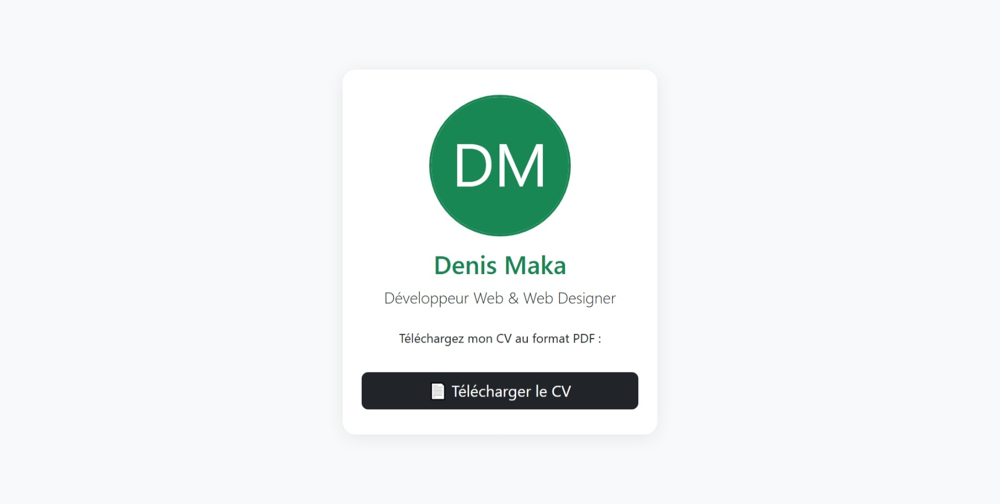

# 📄 CV Téléchargeable

Bienvenue sur le dépôt **CV Téléchargeable** !  
Ce projet propose une solution simple et professionnelle pour permettre aux visiteurs de télécharger un CV au format PDF via un bouton sur votre site web.

---

## 🚀 Fonctionnalités

- 📥 Bouton de téléchargement du CV en PDF
- ⚡️ 100% compatible GitHub Pages (aucun PHP requis)
- 💻 Facile à intégrer dans n'importe quel site (portfolio, blog, etc.)
- 🎨 Personnalisation du style du bouton

---

## 📂 Structure du projet

cv_portfolio_dynamic/
│
├── assets/
│   ├── css/
│   │   └── style.css
│   └── cv/
│       └── Cv Dénis Maka.pdf
├── index.html
└── README.md

---

## 🛠️ Installation

1. **Cloner le dépôt**
   ```bash
   git clone https://github.com/Denismaka/cv_portfolio_dynamic.git
   ```


## 📸 Aperçu



---

## ✨ Personnalisation

- Remplacez le fichier PDF dans `assets/cv/` par votre propre CV.
- Modifiez le fichier `assets/css/style.css` pour adapter le style à vos goûts.
- Personnalisez le contenu de `index.html` selon vos besoins.

---

## 🤝 Contribuer

Les contributions sont les bienvenues !  
N'hésitez pas à ouvrir une issue ou à soumettre une pull request.

---

## 📄 Licence

Ce projet est sous licence [MIT](LICENSE).

---

## 👤 Auteur

- [Dénis Maka](https://github.com/Denismaka)

---

<div align="center">
  
  
</div>

